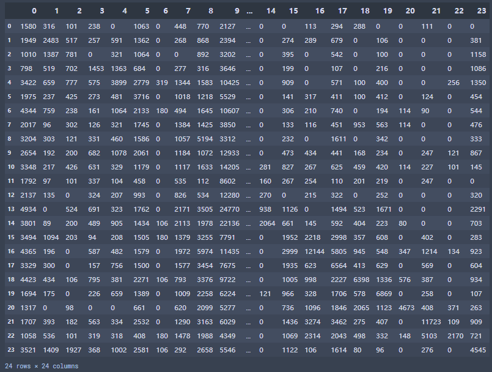
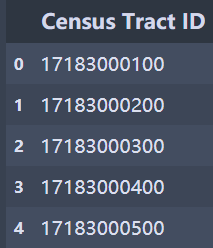

# SafeGraph Mobility 
- **Safegraph Mobility/\_.zip**
  
  - Each zip file contains multiple folders named by metropolitan statistical areas (MSAs), i.e., a total of 384 large city groups in the United States, whose initials match the zip’s name. 
  - Include the weekly frequency matrices of Census Tract-to-Census Tract people movements within each MSA.
  
- **Safegraph Mobility/\_.zip/metropolitan_statistical_area**  
  - Each folder includes the time-series population movement data corresponding to the folder name’s MSA. 
  - All files are comma-delimited CSVs named as “year-month-day.csv”, and from 2019-12-30 to 2022-04-25 in weekly intervals. 
  - Within a CSV file, both the horizontal and vertical columns represent a Census Tract (a geographical region in the city), which is a square matrix with the number of people moving from the horizontal Census Tract to the vertical Census Tract.
  - The Census Tract ID represented by each column or row can be found in the TractID_List.   

  **Data Preview:**  
  

- **Safegraph Mobility/\_.zip/metropolitan_statistical_area/TractID_List**
  - The number in the Nth row is the Census Tract ID corresponding to the Nth row and column in the previous matrices.
  - The Census Tract ID can be associated with the population attributes of each region in the location information datasets. 

  **Data Preview:**  
  

