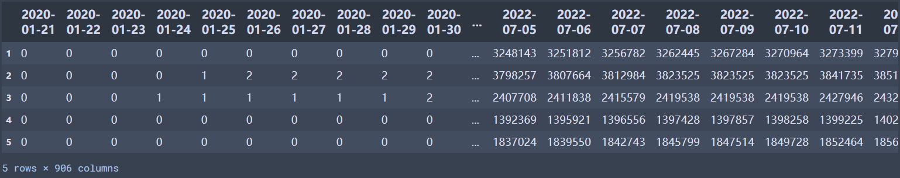
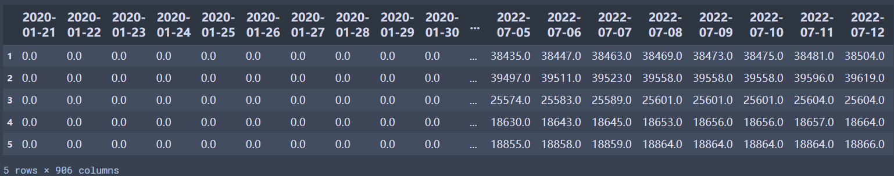
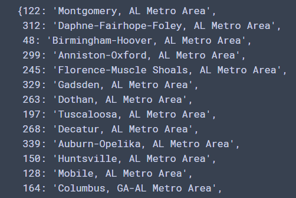

# The NYT Covid Cases Report
- **msa_cumulative_cases.csv**    
Cumulative counts of coronavirus cases in each MSA over time. The timestamps are marked as column names, and each row contains the data serial for an MSA.   
**Data Preview:**

- **msa_cumulative_deaths.csv**   
Cumulative counts of coronavirus death cases in each MSA over time. The timestamps are marked as column names, and each row contains the data serial for an MSA.  
**Data Preview:**

- **msa_dict.pkl**   
A dictionary mapping row indices (the first column in both CSVs) to U.S. cities.    
**Data Preview:**  

