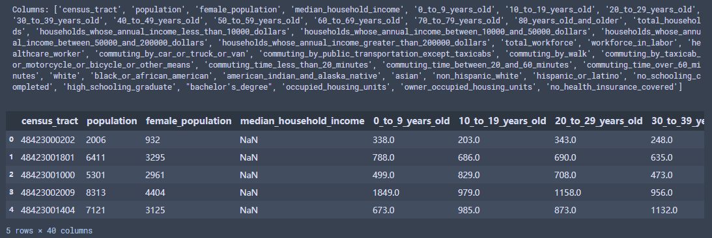

# Urban Region Census
- **Region_Demographics.zip**  
After decompression, you will see a set of CSV files named with MSA locations. Each row in these files contains the demographic data of a census tract. The column names indicate the demographic categories and the values are the population sizes in these categories.   
**Data preview:**  

