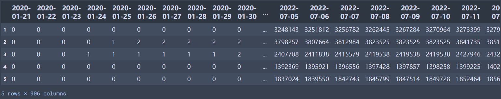
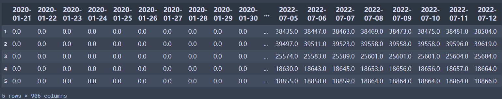
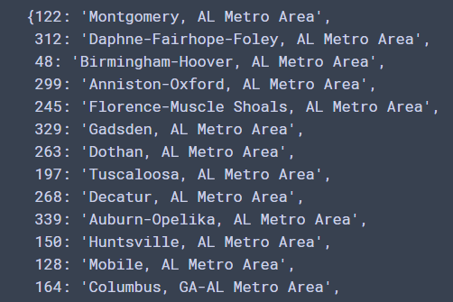

# Covid Cases Data
## Introduction
These datasets are provided by The New York Times, including the daily cumulative number of cases and deaths reported in each US [MSA](https://en.wikipedia.org/wiki/Metropolitan_statistical_area) since the beginning of the pandemic. Below are a few notes which may be helpful when using the datasets.

## Dataset Information
- **msa_cumulative_cases.csv**    
Cumulative counts of coronavirus cases in each MSA over time. The timestamps are marked as column names, and each row contains the data serial for an MSA.   
Data Preview:

- **msa_cumulative_deaths.csv**   
Cumulative counts of coronavirus death cases in each MSA over time. The timestamps are marked as column names, and each row contains the data serial for an MSA.  
Data Preview:

- **msa_dict.pkl**   
A dictionary mapping row indices (the first column in both CSVs) to U.S. cities.    
Data Preview:  

## Citation Information
For papers following APA format, we recommend the following citation: "The New York Times. (2021). Coronavirus (Covid-19) Data in the United States. Retrieved [Insert Date Here], from https://github.com/nytimes/covid-19-data."

If you use it in an online presentation, please link to the New York Times tracking page at https://www.nytimes.com/interactive/2020/us/coronavirus-us-cases.html.