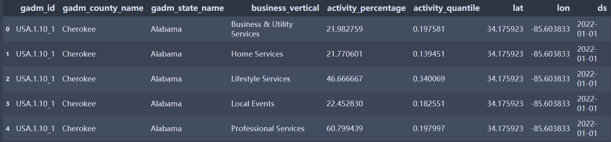

# Meta Business Data
## Introduction
These datasets are provided by Meta, including business posting activities on Facebook from 2020 to 2022. The data can be used to measure how local businesses are affected by and recover from crisis events like the pandemic. Below are a few notes which may be helpful when using the data.

## Dataset Information
- **Facebook_Business_Activity_Trends_White_Paper_IC2S2.pdf**    
Descriptions for how the business activity datasets are constructed and how they enable partners to measure business downtime and   recovery following disasters like COVID-19.

- **FB_COVID_Business_Activity_Trends_Documentation - IC2S2.pdf**       
Documentation for the following CSV data, including the explanations of business activity measurements, CSV column names (codebook), and different business verticals. **Please read this file carefully before you use the data!**  

- **ic2s2_fb_bat_[2020/2021/2022]\_all_agg.csv**     
County-level business activity data on Facebook in [2020/2021/2022]. This dataset aggregates all business verticals.  Each row indicates all the business activities related to a county on a given day.    
Data Preview:  

- **ic2s2_fb_bat_[2020/2021/2022]\_verticals.csv.zip**   
Compressed county-level business activity data on Facebook in [2020/2021/2022]. After decompression, you will see a CSV file with the same file name. This dataset disaggregates business activities into different verticals (types).  Each row indicates a specific business vertical activity related to a county on a given day.   
Data Preview:   

## Citation Information