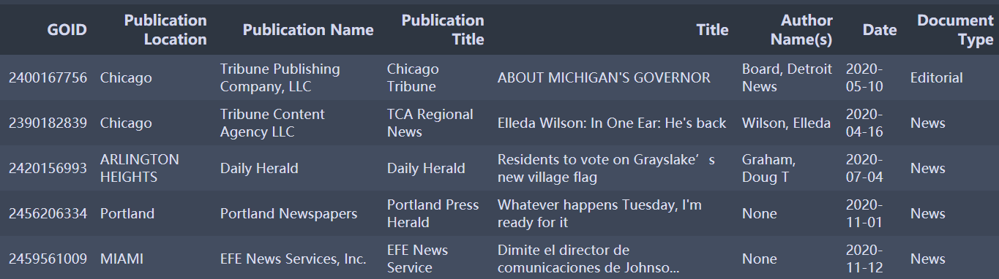
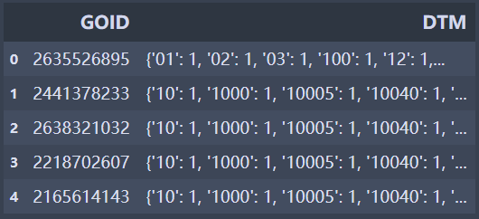

# Proquest News Data 
## Introduction 
These datasets are made from ProQuest US Newsstream using ProQuest TDM Studio. These datasets were created by selecting all [newspaper articles](https://about.proquest.com/en/products-services/nationalsnews_shtml/) with the term 'covid' in the full text. The possible date range is from January 1st, 2019, to July 12th, 2022. Below are a few notes which may be helpful when using the datasets.

## Dataset Information
- **Proquest News Meta Data.csv**  
This CSV file contains metadata for all of the newspaper articles. It also includes a selection of metadata fields detailed here.
 
  - **[GOID]** This can be treated as a unique identifier for the newspaper article.
  - **[Publication Location]** This is the location of where the newspaper is published (e.g., Chicago, New York)
  - **[Publication Title]** This is the title of the newspaper.
  - **[Author Name(s)]** These are the author(s) of the newspaper article. Some of the most prolific authors appear to be: Marni Pyke, Joseph Spector...
  - **[Document Type]** This is the type of a newspaper article. The most common types in this metadata file are News, Blogs, Feature, Obituary, Opinions, Editorial...
  
   Data Preview:  
   
 

- **Proquest News Bag-of-Words/**  
After decompressing the zip files under this directory, you will see a set of CSV files starting with “BoW”. These files include all of the available publication titles within US Newsstream and the word counts for each article (files ending with NoStopWords remove the stopwords). The word counts are stored in dictionaries where the keys are words and the values are word frequencies.   
Data Preview:  
 

## Citation Information
ProQuest, TDM Studio US Newsstream Dataset, [Unpublished Raw Data]. ProQuest Part of Clarivate 
