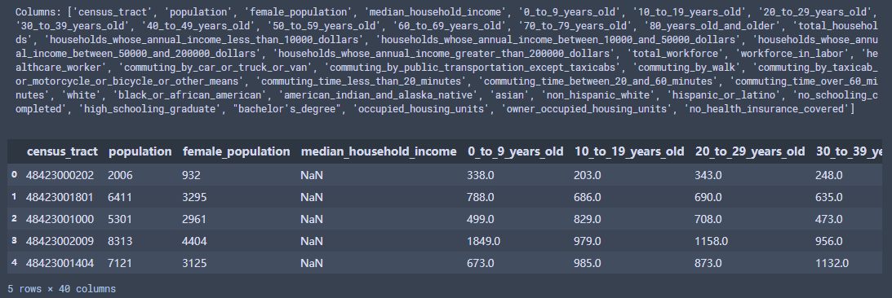

# Urban Region Demographic Data
## Introduction 
This dataset is collected from the latest census, including the population size for different demographic categories (e.g., female, 0_to_9_years_old, asian…) in each US [MSA](https://en.wikipedia.org/wiki/Metropolitan_statistical_area). Below are a few notes which may be helpful when using the data.

## Dataset Information
- **Region_Demographics.zip**  
After decompression, you will see a set of CSV files named with MSA locations. Each row in these files contains the demographic data of a census tract. The column names indicate the demographic categories and the values are the population sizes in these categories.   
Data preview:  

